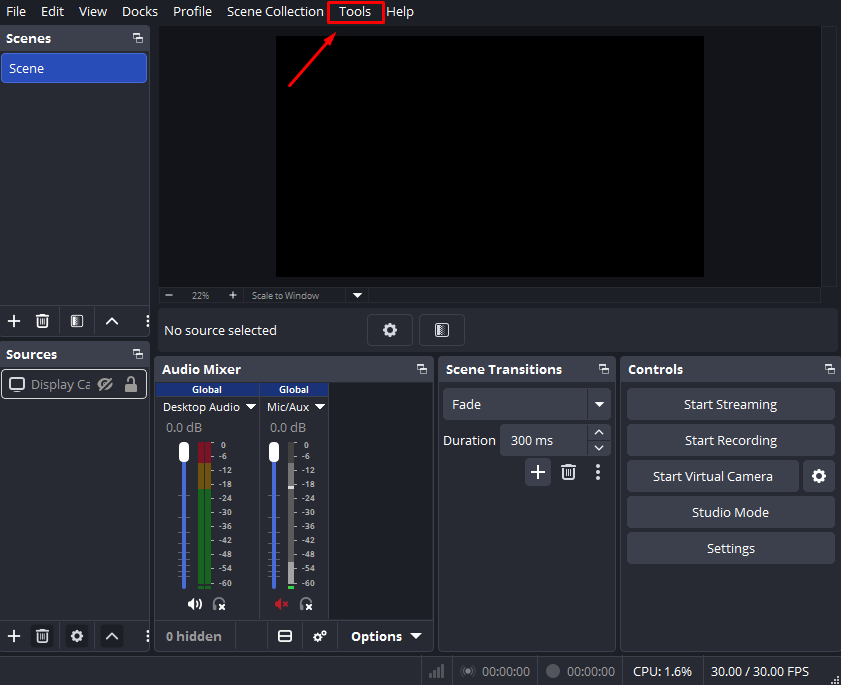
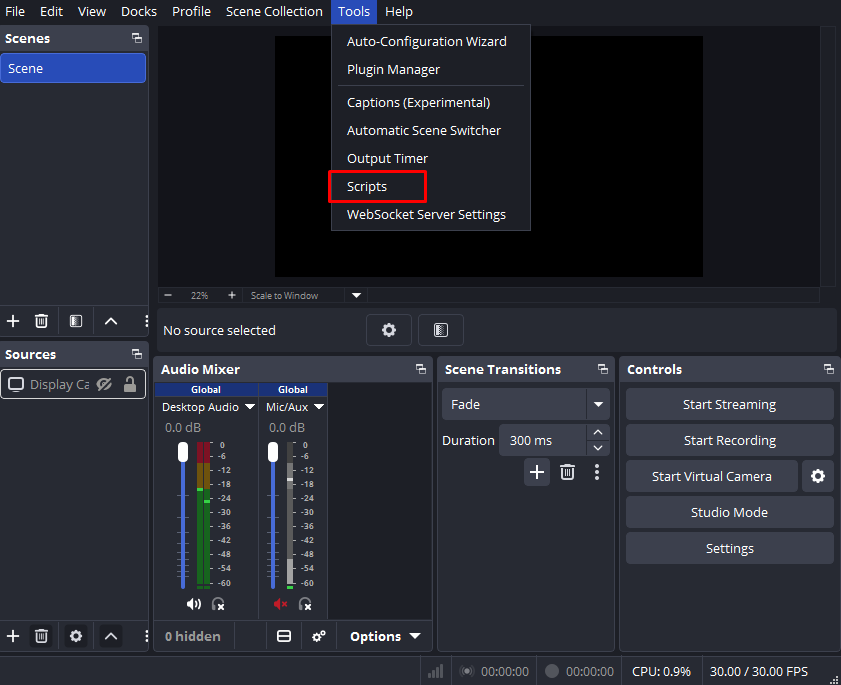
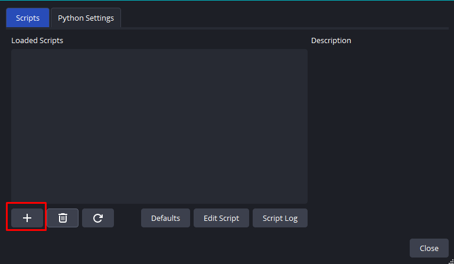

# ✂️ OBS LiveCut 
**The "Zero-Editing" plugin for OBS Studio.**

Stop spending hours cutting out mistakes. **OBS LiveCut** allows you to trim bad takes and **Pause / Resume** your recording "edits" using simple hotkeys. When you hit stop, your edited video is already waiting for you.

---

## 🔒 Privacy & Transparency
We believe in user privacy and security.
* **Audit the Code:** The setup script is provided as a transparent `.bat` file. You can open it in any text editor (like Notepad) to see exactly what it does before running it.
* **Custom Setup:** For maximum privacy, we provide the `setup_instructions.txt` file. You can copy the code from there into your own `.bat` file to ensure you know exactly what is running on your machine.
* **No Hidden Actions:** The script only performs three tasks: downloads FFmpeg from the official source, moves it to your C: drive, and updates your Windows Path.

---

## 💎 Why OBS LiveCut?
* **Zero Data Loss (Safety First):** The plugin **never** touches your original file. It creates a brand new `_FinalTrimmed` version. If anything goes wrong, your raw footage is 100% safe.
* **Pro Hotkeys:** Bind **Cut 10s**, **Cut 30s**, and **Pause / Resume** to any key or mouse button. It works even while you are tabbed into a game.
* **Frame-Perfect Sync:** Uses a high-end FFmpeg filter engine to ensure your audio and video stay perfectly aligned with zero lag.
* **Privacy**: Your mistakes never leave your PC. PC.	Your "bad takes" aren't sitting on Google's servers until you cut them out with Youtube Studio.
* **Storage**: Your final file is already small and clean.
* **Workflow**: Active. Edit while the energy is high!
---

## 🚀 Easy Setup (Recommended)
1. [**Download the setup (.bat)**](https://github.com/alphaboost33/OBS-LiveCut/releases/latest/download/setup_livecut.bat)
2. **Right-click** the file and select **"Run as Administrator"**.
3. Restart OBS Studio.

---

## 🛠️ Manual Setup
If you prefer to configure Windows yourself, follow these steps:

### 1. Install FFmpeg
* Download the "Essentials" zip from [gyan.dev](https://www.gyan.dev/ffmpeg/builds/ffmpeg-release-essentials.zip).
* Inside, you will see a folder. Copy that entire folder and paste it directly into your `C:\` drive. 
* Right-click the folder on your `C: drive`, select Rename, and change its name to just ffmpeg (so the full path is exactly `C:\ffmpeg`).

### 2. Set Windows Environment Variables
The OBS script uses PowerShell to call FFmpeg. For PowerShell to know what "ffmpeg" means, you have to add it to your Windows Environment Variables.
➡  Press the Windows Key on your keyboard, type Environment Variables, and hit Enter. (The exact option is usually called "Edit the system environment variables").
➡  At the bottom right of the window that pops up, click the Environment Variables... button.
➡  In the bottom list (System variables), scroll down until you see the variable named Path. Click on it to highlight it, then click Edit....
➡  Click the New button on the right side.
➡  Type exactly this: `C:\ffmpeg\bin`
➡  Click OK on all three windows to save and close them.

---

## 📖 How to Use

### 1. Load the Script
[**Download the Script (.lua)**](https://github.com/alphaboost33/OBS-LiveCut/releases/latest/download/obs_livecut.lua)

Open OBS and go to **Tools** ➔ **Scripts**. Click the **+** button and select the `obs_livecut.lua` you just downloaded.

  
   <i>Open Tools tab.</i>

  
   <i>Select Scripts.</i>

  
   <i>Click the "+" icon in the bottom left of the Scripts window. Once loaded, you will see the OBS LiveCut controls on the right.</i>

### 2. Set Your Hotkeys
Go to **Settings** ➔ **Hotkeys**. Search for "OBS LiveCut" and bind your keys:
* **Cut Last 10s / 30s:** Instantly removes the last segment of time from the final edit.
* **Pause / Resume:** Stop the "edit" timer while you take a break, then resume when you're ready.

### 3. The Result
In your recording folder, you will see two files:
1. `Original_Video.mp4` — Your full, original recording.
2. `Original_Video_FinalTrimmed.mp4` — Your clean, edited version.

---

## 📜 License
Licensed under the **MIT License**. Created with 🦾 for the creator community.
